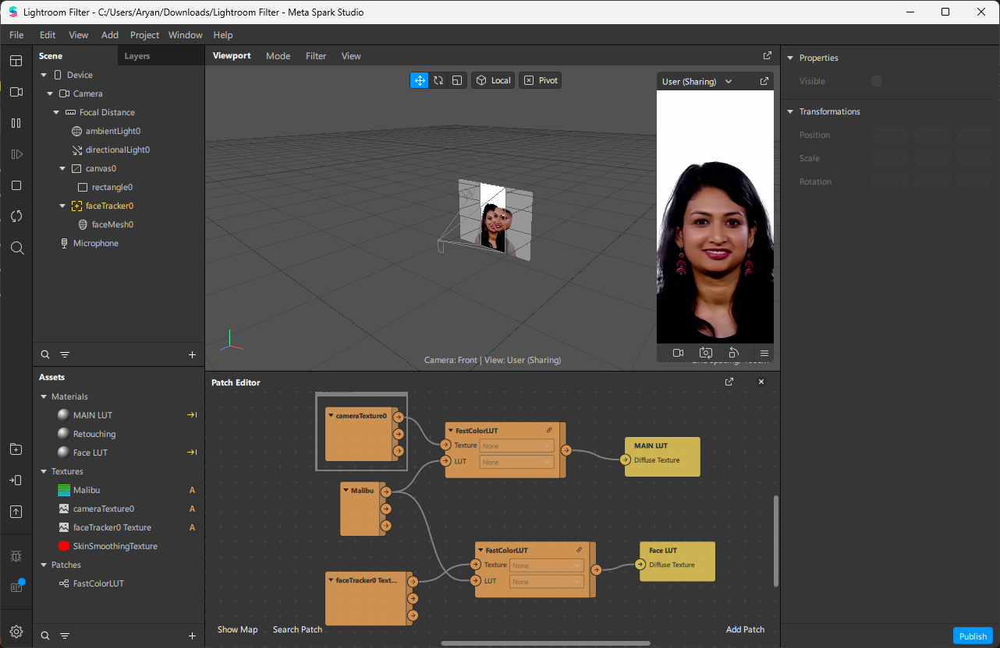

# Insta Filter Wizard

</img>

Create and apply Instagram-style filters to photos easily with Insta Filter Wizard.

## Description

Insta Filter Wizard is a powerful tool that empowers you to create Lightroom presets similar to Instagram filters. Craft your unique filters and apply them to your photos effortlessly. Take your creativity to the next level and enhance your photos with custom looks.

## Usage

Follow these steps to apply your Insta Filter Wizard filter to an image, integrate it with SparkAR, and upload it to Instagram:

1. **Apply Filter to Image**:
   - Locate the `BaseColor.png` image file in the `base` folder of this repository.
   - Apply your custom Insta Filter Wizard filter to the `BaseColor.png` image using your preferred image editing software or Lightroom.

2. **Integrate with SparkAR**:
   - Open SparkAR, a platform for creating augmented reality effects.
   - Import the modified `BaseColor.png` image into SparkAR's resources.

3. **Replace Default Filter**:
   - In SparkAR's Patch Editor, locate the node representing the default "Malibu Filter"
   - Replace the "Malibu Filter" node with your custom Insta Filter.

4. **Save and Export**:
   - Save your SparkAR project with the new filter integration.
   - Export the project to a compatible Meta platform (Instagram/Facebook).

5. **Upload to Instagram**:
   - Open Instagram and After Publishing Open your Filter.
   - Share your creative content with the world!

Enjoy sharing your unique Insta Filter Wizard filters on Instagram and inspiring others with your creative vision.

---

For detailed documentation and additional resources, please refer to [Spark](https://spark.meta.com/learn/) section.

If you have questions, suggestions, or want to contribute, feel free to open an issue or pull request.

Happy filtering!